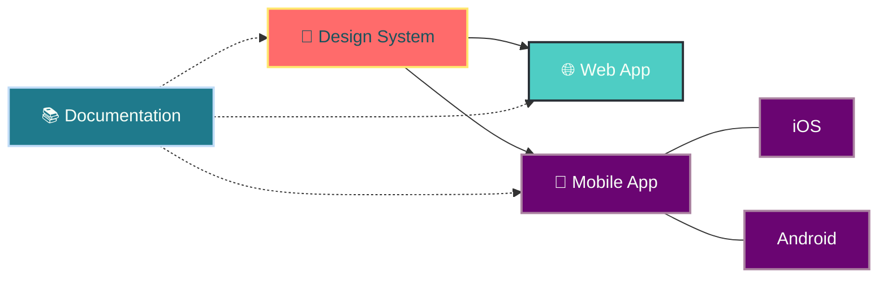

<div align="center">


  <h1 align="center">
    
  </h1>
</div>

<p align="center">
  
  <a href="https://github.com/whispr-messenger/Whispr-Frontend/blob/main/LICENSE">
    
  </a>
  <a href="https://github.com/whispr-messenger/Whispr-Frontend/blob/main/CONTRIBUTING.md">
    
  </a>
  
  
</p>

## 📝 Description

Whispr est une plateforme de messagerie sécurisée offrant une expérience utilisateur fluide sur web et mobile. Ce dépôt contient le code frontend de l'application avec une architecture orientée composants et un design system partagé. Whispr permet des communications chiffrées de bout en bout, des discussions privées et des transferts de fichiers sécurisés.

## 📑 Table des matières

- [Description](#-description)
- [Architecture du projet](#-architecture-du-projet)
- [Tech Stack & Outils](#️-tech-stack--outils)
- [Démarrage rapide](#-démarrage-rapide)
- [Contribution](#-contribution)
- [Ressources utiles](#-ressources-utiles)

## 🏗 Architecture du projet

```
whispr-frontend/
├── 🌐 web/            # Application web (PWA)
│   ├── 📁 src/        # Code source
│   └── 🗂️ public/     # Ressources statiques
├── 📱 mobile/         # Applications mobiles (React Native)
│   ├── 📁 src/        # Code source partagé
│   ├── 🍏 ios/        # Config spécifique iOS
│   └── 🤖 android/    # Config spécifique Android
├── 🎨 design-system/  # Composants UI partagés
│   └── 📁 src/        # Bibliothèque de composants
├── 📚 docs/           # Documentation technique
├── ⚙️ scripts/        # Scripts de build & déploiement
├── 🛠️ .github/        # Workflows, templates PR/issues
├── 📄 README.md       # Ce fichier
└── 📝 CONTRIBUTING.md # Guide de contribution
```

### Schéma d'architecture



## ⚙️ Tech Stack & Outils

| Couche | Technologies principales | Objectif |
|-------|------------------------|----------|
| 🌐 **Web App** | [**React**](https://reactjs.org/), [**Vite**](https://vitejs.dev/), [**Redux Toolkit**](https://redux-toolkit.js.org/) | PWA, gestion d'état |
| 📱 **Mobile App** | [**React Native**](https://reactnative.dev/), [**Redux Toolkit**](https://redux-toolkit.js.org/) | iOS/Android, navigation |
| 🎨 **Design System** | [**Storybook**](https://storybook.js.org/), [**Styled-components**](https://styled-components.com/) | Bibliothèque UI, documentation |
| ✅ **Qualité** | [**ESLint**](https://eslint.org/), [**Prettier**](https://prettier.io/), [**Jest**](https://jestjs.io/), [**Testing Library**](https://testing-library.com/) | Qualité code, tests |
| ⚙️ **CI/CD** | [**GitHub Actions**](https://github.com/features/actions) | Automatisation, déploiement |
| 📚 **Documentation** | [**Markdown**](https://www.markdownguide.org/), [**Mermaid**](https://mermaid.js.org/), [**Storybook**](https://storybook.js.org/) | Documentation, diagrammes |

## 🚀 Démarrage rapide

### 1. **Cloner le dépôt**
```bash
git clone https://github.com/whispr-messenger/Whispr-Frontend.git
cd Whispr-Frontend
```

### 2. **Installer les dépendances**
```bash
# Installation des dépendances web
cd web && npm install

# Installation des dépendances mobile
cd ../mobile && npm install

# Installation des dépendances design system
cd ../design-system && npm install
```

### 3. **Lancer les applications**
| App | Commande |
|-----|----------|
| 🌐 **Web** | `npm run dev` |
| 📱 **Mobile** | `npm run start` |
| 🎨 **Design System** | `npm run storybook` |

### 4. **Builder pour la production**
```bash
# Build web
cd web && npm run build

# Build mobile
cd ../mobile && npm run build

# Build design system
cd ../design-system && npm run build
```

### 5. **Tester**
```bash
# Tests unitaires et d'intégration
npm run test

# Tests e2e
npm run test:e2e
```

## 🤝 Contribution

Veuillez lire [CONTRIBUTING.md](./CONTRIBUTING.md) pour notre workflow, standards de code et processus de PR.

## 📚 Ressources utiles

- [Documentation du projet](./docs/)
- [Design System Storybook](http://localhost:6006)
- [Référence API](./docs/api.md)
- [Conventional Commits](https://www.conventionalcommits.org/)
- [Normes d'accessibilité WCAG](https://www.w3.org/WAI/standards-guidelines/wcag/)
- [Guide de style](./docs/style-guide.md)
- [Architecture flux de données](./docs/data-flow.md)
